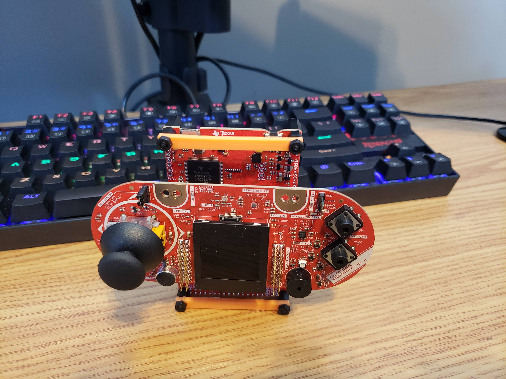

# Galaga_ARM
A game inspired by Gaglaga, written in C, for the TI msp432p401r and the educational booster pack

## Challenges Faced
  - Low power of CPU creates stuttering
  - Refresh rate on screen 
  - Multi-threading needed to fix lag
  - Thermal-throttling the CPU
  - Accepting input from the booster pack

## Resources
  - C 
  - MIPS Assembly 
 
## TI msp432p401r Board

This is the TI msp432p401r with the educational booster pack installed on top.  
The booster pack allows us to use a joystick and four buttons to control the game.

## Demo

